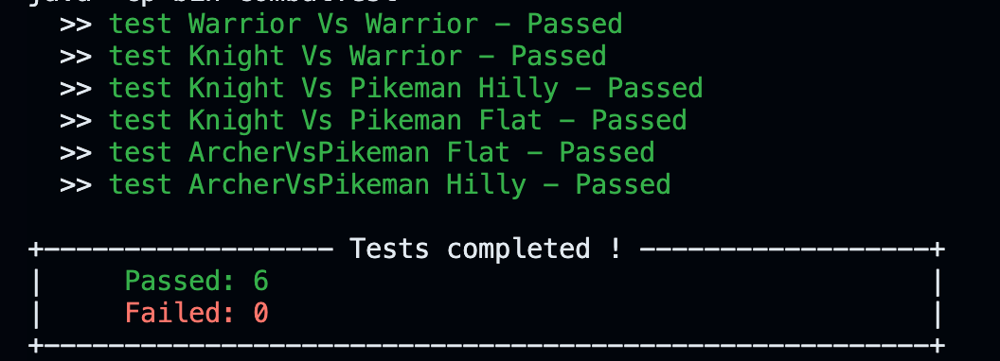

# TP Civilization

> Authors: BENICHOU Yaniv & BONNEFOY Nicolas

## Architecture

The TP's architecture comprises 3 folders:

> - **src/** : Contains all .Java files with class, interface, etc., definitions.
> - **test/** : Holds the set of test files for validating methods implemented in the `src/` directory. Two main files reside here: one encapsulating all the **unit tests** and another serving as a Playground for free testing.
> - **bin/** : Encompasses all .class files generated during compilation, which can be deleted for cleanup.

The **src/** directory implements:

- **Unit** : The primary class representing the game units. It holds attributes like health levels and methods for actions like attack, defend, and more.
- **Warrior, Archer, Pikeman, Knight** : Subclasses of Unit, each symbolizing specific unit types with their distinct behaviors.
- **TerrainType** : An enumeration defining possible terrain types.
- **Grid** : Class portraying the game grid.

## Makefile: Execution Guide

> The Makefile is bundled to streamline the project's compilation and execution process. It carries predefined commands for these tasks.

### Commands:

- **compile** : Compiles all the project's Java files.
- **run** : Executes the main program.
- **clean** : Erases all compiled files, leaving the directory clean and tidy.

### Usage:

To compile the project:

```
make compile
```

To run the project:

```
make run
```

To clear the directory:

```
make clean
```

## Execution Outcome:

